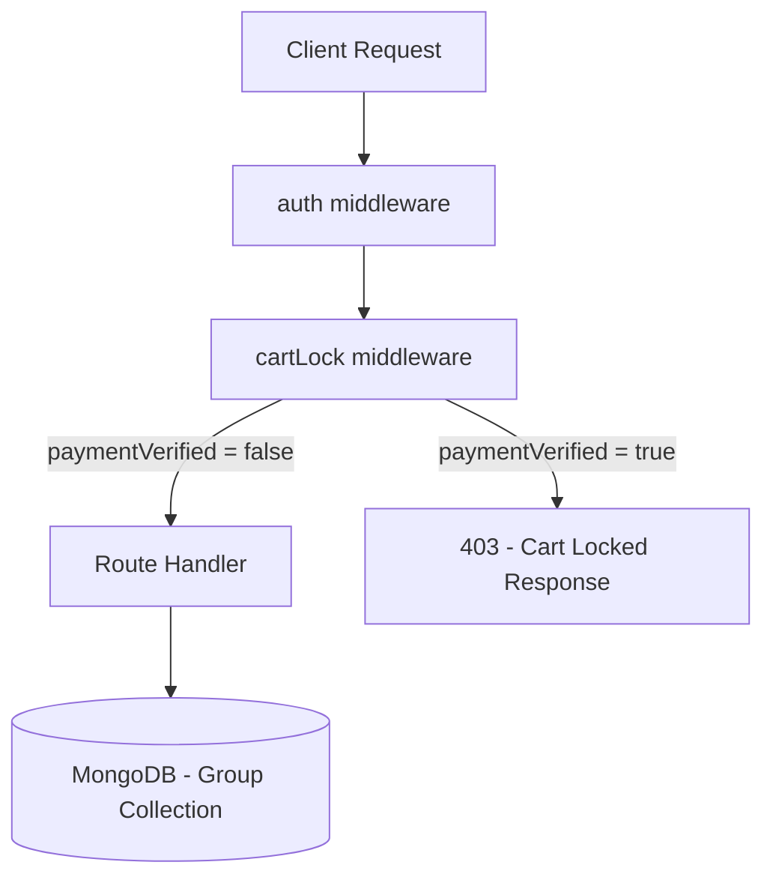
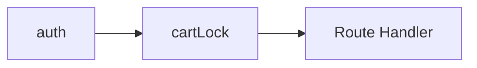
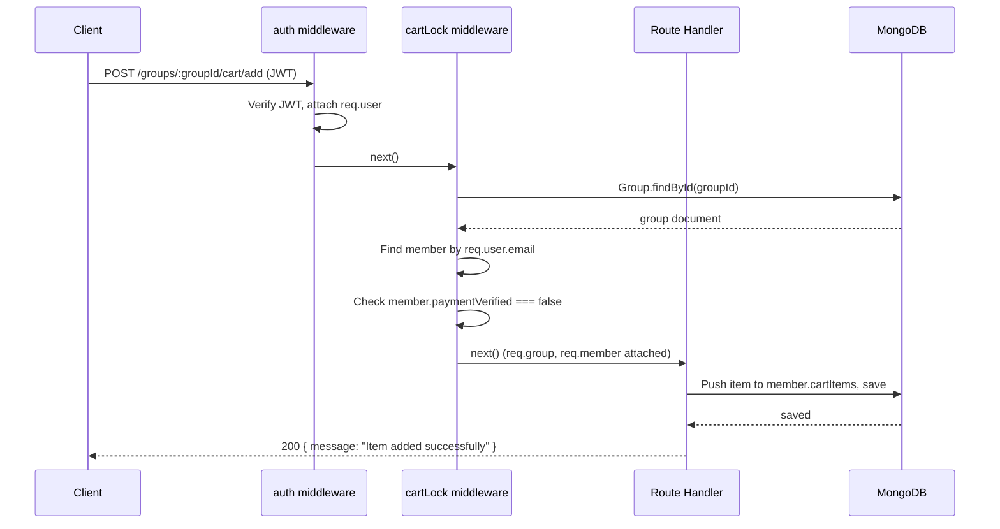
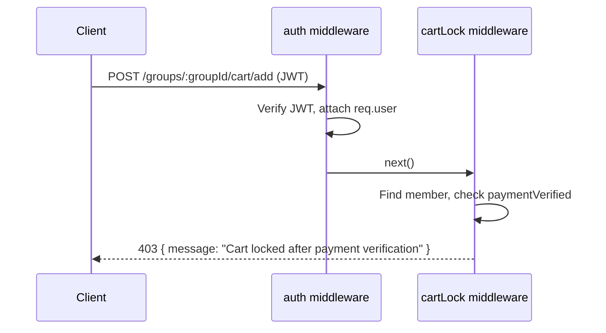

# Design Document: Cart Locking After Payment Verification

## Overview

Cart locking prevents members from modifying their cart (add, edit, remove) once their payment has been verified by the group leader. This protects order integrity — once a leader confirms payment, the member's cart becomes immutable to avoid discrepancies between what was paid for and what gets ordered.

The implementation centralizes this check in a reusable Express middleware (`cartLock`) that runs in the route chain for all cart-mutating endpoints. The existing inline check in `POST /groups/:groupId/cart` is refactored into this middleware, and three new dedicated cart endpoints are created: `POST /groups/:groupId/cart/add`, `PUT /groups/:groupId/cart/edit`, `DELETE /groups/:groupId/cart/remove`.

No schema changes are required — the existing `paymentVerified` boolean on the member sub-document already provides the lock signal.

## Architecture



### Middleware Chain



The `cartLock` middleware slots between `auth` (which attaches `req.user`) and the route handler. It fetches the group, locates the member by their authenticated email, and checks `paymentVerified`. If locked, it short-circuits with a 403 response. If unlocked, it attaches `req.group` and `req.member` for downstream use.

## Sequence Diagrams

### Cart Add — Payment Not Verified (Success Path)



### Cart Add — Payment Verified (Blocked Path)



## Components and Interfaces

### Component 1: cartLock Middleware

**Purpose**: Centralized guard that blocks cart mutations for payment-verified members.

**Interface**:
```javascript
// server/middleware/cartLock.js
const cartLock = async (req, res, next) => { /* ... */ }
module.exports = cartLock;
```

**Responsibilities**:
- Validate `req.user` exists (auth ran before)
- Fetch group by `req.params.groupId`
- Find member matching `req.user.email`
- Block request if `member.paymentVerified === true`
- Attach `req.group` and `req.member` for handler reuse
- Return 403 with standard lock message when blocked

### Component 2: Cart Route Handlers

**Purpose**: Handle add, edit, and remove operations on a member's cart items.

**Interface**:
```javascript
// Route registrations in server.js
app.post("/groups/:groupId/cart/add", [auth, cartLock], addToCart);
app.put("/groups/:groupId/cart/edit", [auth, cartLock], editCartItem);
app.delete("/groups/:groupId/cart/remove", [auth, cartLock], removeFromCart);
```

**Responsibilities**:
- `addToCart`: Push new item to `member.cartItems`, update `member.totalAmount`
- `editCartItem`: Find item by identifier, update quantity/price, recalculate totals
- `removeFromCart`: Find and splice item from `member.cartItems`, recalculate totals

### Component 3: Existing Cart Endpoint (Refactored)

**Purpose**: Maintain backward compatibility of `POST /groups/:groupId/cart` while using centralized middleware.

**Interface**:
```javascript
app.post("/groups/:groupId/cart", [auth, cartLock], existingCartHandler);
```

**Responsibilities**:
- Remove inline `paymentVerified` check
- Reuse `req.group` and `req.member` from middleware
- Preserve exact same response format

## Data Models

### Existing Group Schema (No Changes)

```javascript
// member sub-document within Group.members[]
{
    name: String,
    email: String,
    paid: { type: Boolean, default: false },
    totalAmount: { type: Number, default: 0 },
    paymentVerified: { type: Boolean, default: false },  // <-- lock signal
    cartItems: [{
        productName: String,
        productLink: String,
        quantity: Number,
        price: Number,
        itemTotal: Number
    }]
}
```

**Lock Condition**: `member.paymentVerified === true`

**No schema changes required** — the boolean already exists and is set by `POST /groups/:groupId/verify-payment`.

## Key Functions with Formal Specifications

### Function 1: cartLock(req, res, next)

```javascript
async function cartLock(req, res, next)
```

**Preconditions:**
- `req.user` is defined (auth middleware ran, JWT decoded)
- `req.user.email` is a valid string
- `req.params.groupId` is present in the route

**Postconditions:**
- If group not found: returns 404 `{ message: "Group not found" }`
- If member not found: returns 404 `{ message: "Member not found" }`
- If `member.paymentVerified === true`: returns 403 `{ message: "Cart locked after payment verification" }`
- If `member.paymentVerified === false`: calls `next()` with `req.group` and `req.member` set
- No mutations to database

**Loop Invariants:** N/A

### Function 2: addToCart(req, res)

```javascript
async function addToCart(req, res)
```

**Preconditions:**
- `req.group` and `req.member` are attached by cartLock middleware
- `req.body` contains `productName`, `quantity`, `price` (required), `productLink` (optional)
- `quantity > 0` and `price >= 0`

**Postconditions:**
- New item pushed to `member.cartItems` with calculated `itemTotal = quantity * price`
- `member.totalAmount` increased by `itemTotal`
- Group document saved to database
- Returns 200 `{ message: "Item added successfully", member }`

**Loop Invariants:** N/A

### Function 3: editCartItem(req, res)

```javascript
async function editCartItem(req, res)
```

**Preconditions:**
- `req.group` and `req.member` are attached by cartLock middleware
- `req.body.productName` identifies the item to edit
- At least one of `quantity`, `price`, `productLink` provided

**Postconditions:**
- Target item found in `member.cartItems` by `productName`
- If item not found: returns 404 `{ message: "Item not found in cart" }`
- Updated fields applied, `itemTotal` recalculated
- `member.totalAmount` recalculated as sum of all `itemTotal` values
- Group document saved
- Returns 200 `{ message: "Item updated successfully", member }`

**Loop Invariants:**
- `member.totalAmount === sum(member.cartItems[i].itemTotal)` after recalculation

### Function 4: removeFromCart(req, res)

```javascript
async function removeFromCart(req, res)
```

**Preconditions:**
- `req.group` and `req.member` are attached by cartLock middleware
- `req.body.productName` identifies the item to remove

**Postconditions:**
- Target item found in `member.cartItems` by `productName`
- If item not found: returns 404 `{ message: "Item not found in cart" }`
- Item removed from array
- `member.totalAmount` decreased by removed item's `itemTotal`
- Group document saved
- Returns 200 `{ message: "Item removed successfully", member }`

**Loop Invariants:**
- `member.totalAmount` remains non-negative after removal

## Algorithmic Pseudocode

### cartLock Middleware Algorithm

```javascript
// ALGORITHM: cartLock middleware
// INPUT: req (with req.user from auth), res, next
// OUTPUT: 403 if locked, next() if unlocked

async function cartLock(req, res, next) {
    // PRECONDITION: req.user exists (auth middleware ran)
    if (!req.user) {
        return res.status(401).json({ message: "Authentication required" });
    }

    const groupId = req.params.groupId;

    // Step 1: Fetch group
    const group = await Group.findById(groupId);
    if (!group) {
        return res.status(404).json({ message: "Group not found" });
    }

    // Step 2: Find member by authenticated email
    const member = group.members.find(
        m => m.email === req.user.email
    );
    if (!member) {
        return res.status(404).json({ message: "Member not found" });
    }

    // Step 3: Check lock condition
    // INVARIANT: paymentVerified is a boolean, default false
    if (member.paymentVerified === true) {
        return res.status(403).json({
            message: "Cart locked after payment verification"
        });
    }

    // Step 4: Attach to request for handler reuse
    req.group = group;
    req.member = member;

    // POSTCONDITION: req.group and req.member are set, member is not payment-verified
    next();
}
```

### Add to Cart Algorithm

```javascript
// ALGORITHM: addToCart handler
// INPUT: req (with req.group, req.member from cartLock), res
// OUTPUT: updated member with new item

async function addToCart(req, res) {
    const { productName, productLink, quantity, price } = req.body;
    const member = req.member;
    const group = req.group;

    // PRECONDITION: quantity > 0, price >= 0
    const itemTotal = quantity * price;

    // INVARIANT: itemTotal = quantity * price
    member.cartItems.push({
        productName,
        productLink,
        quantity,
        price,
        itemTotal
    });

    member.totalAmount += itemTotal;
    // POSTCONDITION: member.totalAmount increased by itemTotal

    await group.save();

    return res.json({ message: "Item added successfully", member });
}
```

### Edit Cart Item Algorithm

```javascript
// ALGORITHM: editCartItem handler
// INPUT: req (with req.group, req.member), res
// OUTPUT: updated member with modified item

async function editCartItem(req, res) {
    const { productName, quantity, price, productLink } = req.body;
    const member = req.member;
    const group = req.group;

    // Step 1: Find target item
    const item = member.cartItems.find(i => i.productName === productName);
    if (!item) {
        return res.status(404).json({ message: "Item not found in cart" });
    }

    // Step 2: Apply updates
    if (quantity !== undefined) item.quantity = quantity;
    if (price !== undefined) item.price = price;
    if (productLink !== undefined) item.productLink = productLink;

    // Step 3: Recalculate item total
    item.itemTotal = item.quantity * item.price;

    // Step 4: Recalculate member total
    // LOOP INVARIANT: sum accumulates all itemTotals
    member.totalAmount = member.cartItems.reduce(
        (sum, i) => sum + i.itemTotal, 0
    );
    // POSTCONDITION: member.totalAmount === sum of all itemTotals

    await group.save();

    return res.json({ message: "Item updated successfully", member });
}
```

### Remove from Cart Algorithm

```javascript
// ALGORITHM: removeFromCart handler
// INPUT: req (with req.group, req.member), res
// OUTPUT: updated member with item removed

async function removeFromCart(req, res) {
    const { productName } = req.body;
    const member = req.member;
    const group = req.group;

    // Step 1: Find target item index
    const itemIndex = member.cartItems.findIndex(
        i => i.productName === productName
    );
    if (itemIndex === -1) {
        return res.status(404).json({ message: "Item not found in cart" });
    }

    // Step 2: Remove item and adjust total
    const removedItem = member.cartItems[itemIndex];
    member.totalAmount -= removedItem.itemTotal;
    member.cartItems.splice(itemIndex, 1);

    // POSTCONDITION: member.totalAmount >= 0
    // POSTCONDITION: item no longer in cartItems array

    await group.save();

    return res.json({ message: "Item removed successfully", member });
}
```

## Example Usage

```javascript
// Example 1: Adding an item (member NOT payment-verified)
// Request: POST /groups/abc123/cart/add
// Headers: { Authorization: "jwt-token-here" }
// Body:
{
    "productName": "Maggi Noodles",
    "productLink": "https://store.com/maggi",
    "quantity": 3,
    "price": 14
}
// Response: 200
// { "message": "Item added successfully", "member": { ... } }

// Example 2: Blocked request (member IS payment-verified)
// Request: POST /groups/abc123/cart/add
// Headers: { Authorization: "jwt-token-here" }
// Body: { "productName": "Chips", "quantity": 1, "price": 20 }
// Response: 403
// { "message": "Cart locked after payment verification" }

// Example 3: Editing an item
// Request: PUT /groups/abc123/cart/edit
// Headers: { Authorization: "jwt-token-here" }
// Body: { "productName": "Maggi Noodles", "quantity": 5 }
// Response: 200
// { "message": "Item updated successfully", "member": { ... } }

// Example 4: Removing an item
// Request: DELETE /groups/abc123/cart/remove
// Headers: { Authorization: "jwt-token-here" }
// Body: { "productName": "Maggi Noodles" }
// Response: 200
// { "message": "Item removed successfully", "member": { ... } }
```

## Correctness Properties

*A property is a characteristic or behavior that should hold true across all valid executions of a system — essentially, a formal statement about what the system should do. Properties serve as the bridge between human-readable specifications and machine-verifiable correctness guarantees.*

### Property 1: Lock Immutability

*For any* member whose paymentVerified field is true, *for any* cart-mutating request (add, edit, or remove), the Cart_Lock_Middleware SHALL return a 403 status and the member's cartItems array SHALL remain unchanged.

**Validates: Requirements 1.1**

### Property 2: Unlock Pass-through with Context Attachment

*For any* member whose paymentVerified field is false, *for any* cart-mutating request, the Cart_Lock_Middleware SHALL call next() and SHALL attach the group document to req.group and the member sub-document to req.member.

**Validates: Requirements 1.2, 1.4**

### Property 3: Middleware Read-Only

*For any* request processed by the Cart_Lock_Middleware, regardless of the member's paymentVerified state or whether the group/member is found, the middleware SHALL perform zero write operations to the database.

**Validates: Requirements 1.3**

### Property 4: Total Consistency After Mutation

*For any* sequence of cart mutations (add, edit, remove) on a member's cart, the member's totalAmount SHALL always equal the sum of all itemTotal values in the member's cartItems array.

**Validates: Requirements 6.1, 3.1, 3.2, 4.2, 4.3, 5.2**

### Property 5: Non-Negative Total

*For any* sequence of add, edit, and remove operations on a member's cart, the member's totalAmount SHALL remain greater than or equal to zero.

**Validates: Requirements 6.2**

### Property 6: Add Grows Cart

*For any* valid add-to-cart request (with positive quantity and non-negative price) on an unlocked member, the member's cartItems array length SHALL increase by exactly one, and the new item's itemTotal SHALL equal quantity multiplied by price.

**Validates: Requirements 3.1, 3.2**

### Property 7: Remove Shrinks Cart

*For any* valid remove-from-cart request specifying a productName that exists in the member's cartItems, the member's cartItems array length SHALL decrease by exactly one, and the removed productName SHALL no longer appear in the array.

**Validates: Requirements 5.1, 5.2**

## Error Handling

### Error Scenario 1: Unauthenticated Request

**Condition**: No valid JWT in Authorization header
**Response**: `auth` middleware returns 401 `{ message: "Access denied" }` or `{ message: "Invalid token" }`
**Recovery**: Client must provide a valid JWT

### Error Scenario 2: Group Not Found

**Condition**: `req.params.groupId` does not match any group in the database
**Response**: `cartLock` returns 404 `{ message: "Group not found" }`
**Recovery**: Client verifies the group ID

### Error Scenario 3: Member Not Found

**Condition**: Authenticated user's email does not match any member in the group
**Response**: `cartLock` returns 404 `{ message: "Member not found" }`
**Recovery**: User must join the group first via `POST /groups/:id/join`

### Error Scenario 4: Cart Locked

**Condition**: `member.paymentVerified === true`
**Response**: `cartLock` returns 403 `{ message: "Cart locked after payment verification" }`
**Recovery**: None — this is intentional. Leader must un-verify if correction needed (future feature)

### Error Scenario 5: Item Not Found (Edit/Remove)

**Condition**: `productName` in request body doesn't match any item in cart
**Response**: Handler returns 404 `{ message: "Item not found in cart" }`
**Recovery**: Client verifies the product name

### Error Scenario 6: Database Error

**Condition**: MongoDB connection failure or write error
**Response**: 500 `{ message: error.message }`
**Recovery**: Retry request; no partial writes due to Mongoose document-level save

## Testing Strategy

### Unit Testing Approach

- Mock `Group.findById` to return controlled group documents
- Test `cartLock` middleware in isolation with various member states
- Verify correct status codes and messages for each scenario
- Test that `req.group` and `req.member` are properly attached on success

### Property-Based Testing Approach

**Property Test Library**: fast-check (JavaScript)

- **Property 1**: For any member with `paymentVerified = true`, all cart mutation requests return 403
- **Property 2**: For any valid add operation, `totalAmount` after === `totalAmount` before + `quantity * price`
- **Property 3**: For any edit operation, `totalAmount` === sum of all `itemTotal` values
- **Property 4**: For any remove operation, `totalAmount` after === `totalAmount` before - removed `itemTotal`

### Integration Testing Approach

- End-to-end flow: create group → join → add item → verify payment → attempt add (expect 403)
- Verify existing `POST /groups/:groupId/cart` still works identically
- Test all three new endpoints with both locked and unlocked states

### Manual Testing Steps

1. **Setup**: Create a group and join as a member
2. **Add item (unlocked)**: `POST /groups/:groupId/cart/add` with valid item → expect 200
3. **Edit item (unlocked)**: `PUT /groups/:groupId/cart/edit` → expect 200
4. **Verify payment**: Leader calls `POST /groups/:groupId/verify-payment` for the member
5. **Add item (locked)**: `POST /groups/:groupId/cart/add` → expect 403 with lock message
6. **Edit item (locked)**: `PUT /groups/:groupId/cart/edit` → expect 403
7. **Remove item (locked)**: `DELETE /groups/:groupId/cart/remove` → expect 403
8. **Legacy endpoint (locked)**: `POST /groups/:groupId/cart` → expect 403

## Performance Considerations

- The `cartLock` middleware performs one `Group.findById` query. Since route handlers also need the group, attaching it to `req.group` eliminates a duplicate DB call.
- Member lookup within the `members` array is O(n) where n is group size. Group sizes are small (typically < 20 members), so this is negligible.
- No additional indexes required — existing `_id` index covers `findById`.

## Security Considerations

- Cart lock is enforced server-side — client cannot bypass by omitting headers or changing request shape.
- The middleware uses `req.user.email` from the verified JWT, not from request body — prevents impersonation.
- Lock cannot be removed by the member themselves — only the leader's `verify-payment` endpoint controls the flag.

## Dependencies

- **express** (existing): HTTP framework
- **mongoose** (existing): MongoDB ODM
- **jsonwebtoken** (existing): JWT verification in auth middleware
- No new dependencies required
