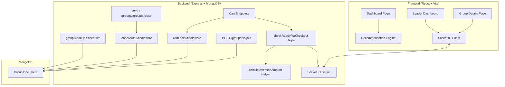
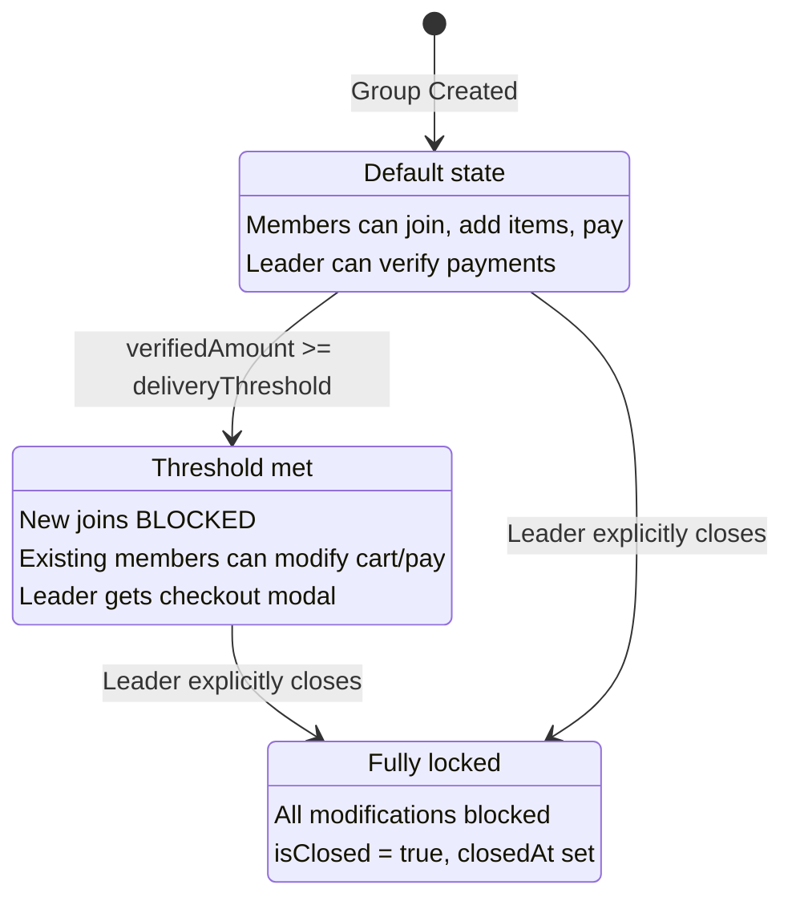
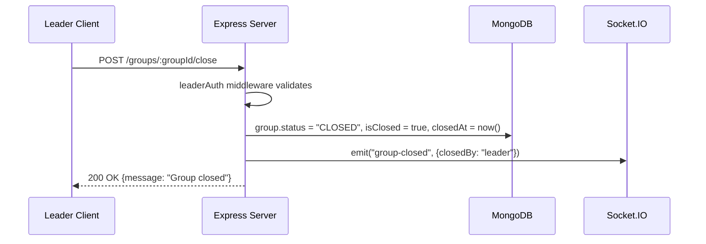
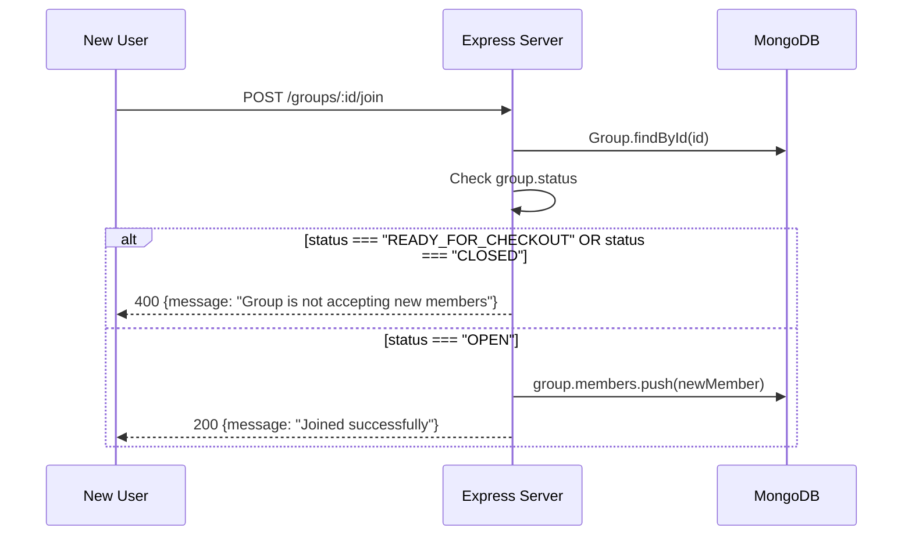

# Design Document: Checkout Readiness — 3-State Group Lifecycle

## Overview

This feature replaces the binary open/closed group model with a 3-state lifecycle: **OPEN → READY_FOR_CHECKOUT → CLOSED**. Currently, TARGET mode groups auto-close when the delivery threshold is reached, immediately locking all modifications and removing leader control. The new design introduces an intermediate `READY_FOR_CHECKOUT` state that signals threshold achievement while keeping the group functional for existing members. Only the leader can explicitly transition to `CLOSED`, gaining full control over the checkout timing.

The change affects the Mongoose schema (new status enum), cart lock logic (block only on CLOSED), join endpoint (block on READY_FOR_CHECKOUT and CLOSED), a new `checkReadyForCheckout` helper replacing `checkAndAutoCloseGroup`, a new Socket.IO event (`group-ready-for-checkout`), the close endpoint (leader-only explicit close), and frontend UI (status badges, recommendation filtering, checkout modal).

Backward compatibility is preserved: existing groups with `isClosed: true` continue to work as CLOSED, and the `isClosed` boolean remains as a derived flag set alongside `status = "CLOSED"`.

## Architecture




## State Machine



## Sequence Diagrams

### Threshold Reached → Ready for Checkout

```mermaid
sequenceDiagram
    participant Leader as Leader Client
    participant Server as Express Server
    participant DB as MongoDB
    participant Socket as Socket.IO

    Leader->>Server: POST /groups/:groupId/verify-payment {email}
    Server->>DB: member.paymentVerified = true; group.save()
    Server->>Server: checkReadyForCheckout(group)
    Server->>Server: calculateVerifiedAmount(group)
    alt verifiedAmount >= deliveryThreshold AND status === "OPEN"
        Server->>DB: group.status = "READY_FOR_CHECKOUT"; group.save()
        Server->>Socket: emit("group-ready-for-checkout", payload)
        Socket->>Leader: group-ready-for-checkout event
        Note over Leader: Checkout modal appears
    end
    Server-->>Leader: 200 OK {paymentVerified, readyForCheckout}
```


### Leader Closes Group



### New Member Tries to Join Ready Group



## Components and Interfaces

### Component 1: Group Schema (Mongoose Model)

**Purpose**: Define the group document structure with the new 3-state lifecycle.

**Interface**:
```javascript
// server/models/group.js - Schema changes
const groupSchema = new mongoose.Schema({
  // ... existing fields unchanged ...

  status: {
    type: String,
    enum: ["OPEN", "READY_FOR_CHECKOUT", "CLOSED"],
    default: "OPEN"
  },

  isClosed: {
    type: Boolean,
    default: false
  },

  closedAt: {
    type: Date,
    default: null
  }
});
```


**Responsibilities**:
- Enforce valid status transitions via enum constraint
- Maintain backward compatibility: `isClosed` remains as derived flag (set true only when status = CLOSED)
- Default new groups to `OPEN` (replaces `ACTIVE`)

**Migration Strategy**:
- Existing groups with `status: "ACTIVE"` and `isClosed: false` → treated as `OPEN`
- Existing groups with `isClosed: true` → treated as `CLOSED`
- No data migration needed: application logic handles legacy `ACTIVE` values gracefully

---

### Component 2: calculateVerifiedAmount Helper

**Purpose**: Compute the sum of `totalAmount` for all members whose `paymentVerified === true`.

**Interface**:
```javascript
// server/helpers/cartHelpers.js
/**
 * @param {Object} group - Mongoose group document
 * @returns {Number} - Sum of totalAmount for verified members
 */
const calculateVerifiedAmount = (group) => {
  return group.members.reduce((sum, member) => {
    return member.paymentVerified === true
      ? sum + member.totalAmount
      : sum;
  }, 0);
};
```

**Responsibilities**:
- Pure function, no side effects
- Returns 0 for groups with no verified members
- Handles edge case of empty members array

---

### Component 3: checkReadyForCheckout Helper

**Purpose**: Replace `checkAndAutoCloseGroup`. When verified amount meets threshold, transition to READY_FOR_CHECKOUT (not CLOSED).

**Interface**:
```javascript
// server/helpers/cartHelpers.js
/**
 * @param {Object} group - Mongoose group document
 * @returns {Object} - { transitioned: Boolean, verifiedAmount: Number }
 */
const checkReadyForCheckout = async (group) => { /* ... */ };
```

**Responsibilities**:
- Only triggers for groups in `OPEN` status with `closeMode === "TARGET"`
- Calculates verified amount using `calculateVerifiedAmount`
- Sets `status = "READY_FOR_CHECKOUT"` when threshold met
- Does NOT set `isClosed` (group remains open for existing members)
- Emits `group-ready-for-checkout` socket event
- Returns transition state for caller to include in response


---

### Component 4: cartLock Middleware (Modified)

**Purpose**: Block cart operations only when group status is `CLOSED` (not `READY_FOR_CHECKOUT`).

**Interface**:
```javascript
// server/middleware/cartLock.js - Modified check
// BEFORE: if (group.isClosed) { block }
// AFTER:  if (group.status === "CLOSED" || group.isClosed) { block }
```

**Responsibilities**:
- Continue blocking when `isClosed === true` (backward compat for legacy groups)
- Block when `status === "CLOSED"` (new primary check)
- Allow cart ops when `status === "READY_FOR_CHECKOUT"` (existing members can still add/edit/pay)
- No change to payment-verified lock logic

---

### Component 5: Join Endpoint (Modified)

**Purpose**: Block new member joins when group is in READY_FOR_CHECKOUT or CLOSED.

**Interface**:
```javascript
// POST /groups/:id/join - Modified guard
// BEFORE: if (group.isClosed) { block }
// AFTER:  if (group.status === "READY_FOR_CHECKOUT" ||
//              group.status === "CLOSED" ||
//              group.isClosed) { block }
```

**Responsibilities**:
- Return 400 with descriptive message for non-OPEN groups
- Preserve existing duplicate membership check
- Backward compat: legacy `isClosed` still blocks joins

---

### Component 6: Close Endpoint (Modified)

**Purpose**: Leader explicitly closes group. Sets both `status` and `isClosed` for full backward compatibility.

**Interface**:
```javascript
// POST /groups/:groupId/close
// Sets: group.status = "CLOSED", group.isClosed = true, group.closedAt = new Date()
```

**Responsibilities**:
- Only accessible by leader (leaderAuth middleware)
- Works from both OPEN and READY_FOR_CHECKOUT states
- Emits `group-closed` socket event
- Returns error if already CLOSED


---

### Component 7: Socket Event — group-ready-for-checkout

**Purpose**: Notify all group members in real-time when threshold is met.

**Interface**:
```javascript
// server/helpers/socketEvents.js
const emitGroupReadyForCheckout = (groupId, data) => {
  emitToGroup(groupId, "group-ready-for-checkout", { groupId, ...data });
};

// Payload shape:
// {
//   groupId: String,
//   verifiedAmount: Number,
//   threshold: Number,
//   pendingMembers: [{ name, email, totalAmount }],
//   pendingAmount: Number
// }
```

**Responsibilities**:
- Emit to all connected clients in the group room
- Include actionable data for the leader checkout modal
- `pendingMembers`: members with `paymentVerified === false`
- `pendingAmount`: sum of totalAmount for unverified members

---

### Component 8: Frontend — Status Badges

**Purpose**: Display group lifecycle state on dashboard cards.

**Interface**:
```javascript
// Badge component usage
<Badge variant={statusVariant} label={statusLabel} />

// Status mapping:
// OPEN → variant="success", label="Open"
// READY_FOR_CHECKOUT → variant="warning", label="Ready"
// CLOSED → variant="error", label="Closed"
```

**Responsibilities**:
- Render on DashboardPage group cards
- Render on GroupDetailsPage header
- Replace existing binary open/closed indicator

---

### Component 9: Frontend — Recommendation Engine Filter

**Purpose**: Exclude non-OPEN groups from recommendations.

**Interface**:
```javascript
// client/src/services/groupRecommendationService.js
// Filter: only recommend groups where status === "OPEN"
// BEFORE: filter out isClosed === true
// AFTER:  filter out status !== "OPEN"
```

---

### Component 10: Frontend — Leader Checkout Modal

**Purpose**: Show checkout confirmation when group enters READY_FOR_CHECKOUT.

**Interface**:
```javascript
// Triggered by: socket event "group-ready-for-checkout"
// Shows: verified amount, threshold, pending members list, close button
// Action: POST /groups/:groupId/close
```


## Data Models

### Group Document (Modified Fields)

```javascript
{
  // Existing fields (unchanged)
  storeName: String,
  groupLeader: String,
  leaderName: String,
  hostelName: String,
  closingTime: Date,
  deliveryFee: Number,
  deliveryThreshold: Number,
  handlingFee: Number,
  platformFee: Number,
  closeMode: String,  // "TIME" | "TARGET"
  paymentQR: String,
  members: [MemberSubdoc],

  // Modified fields
  status: {
    type: String,
    enum: ["OPEN", "READY_FOR_CHECKOUT", "CLOSED"],
    default: "OPEN"   // Changed from "ACTIVE"
  },

  // Kept for backward compat (derived from status)
  isClosed: { type: Boolean, default: false },
  closedAt: { type: Date, default: null }
}
```

**Validation Rules**:
- `status` must be one of the enum values
- `isClosed` must always be `true` when `status === "CLOSED"`
- `closedAt` must be set when `status === "CLOSED"`
- Transition OPEN → READY_FOR_CHECKOUT: only when `closeMode === "TARGET"` and verified amount >= threshold
- Transition to CLOSED: only by leader action (or TIME mode expiry handled by cleanup)

### Member Subdocument (Unchanged)

```javascript
{
  name: String,
  email: String,
  paid: Boolean,
  totalAmount: Number,
  paymentVerified: Boolean,
  cartItems: [CartItemSubdoc]
}
```

## Key Functions with Formal Specifications

### Function 1: calculateVerifiedAmount(group)

```javascript
const calculateVerifiedAmount = (group) => {
  return group.members.reduce((sum, member) => {
    return member.paymentVerified === true
      ? sum + member.totalAmount
      : sum;
  }, 0);
};
```

**Preconditions:**
- `group` is a valid Mongoose document with `members` array
- Each member has `paymentVerified` (Boolean) and `totalAmount` (Number)

**Postconditions:**
- Returns a non-negative number
- Result equals the sum of `totalAmount` for all members where `paymentVerified === true`
- Returns 0 if no members are verified or members array is empty
- No side effects on group document

**Loop Invariants:**
- `sum` is always >= 0
- `sum` equals the cumulative total of verified members processed so far


### Function 2: checkReadyForCheckout(group)

```javascript
const checkReadyForCheckout = async (group) => {
  const verifiedAmount = calculateVerifiedAmount(group);

  if (
    group.closeMode === "TARGET" &&
    group.status === "OPEN" &&
    group.deliveryThreshold > 0 &&
    verifiedAmount >= group.deliveryThreshold
  ) {
    group.status = "READY_FOR_CHECKOUT";
    await group.save();

    const pendingMembers = group.members
      .filter(m => !m.paymentVerified)
      .map(m => ({ name: m.name, email: m.email, totalAmount: m.totalAmount }));

    const pendingAmount = pendingMembers.reduce((s, m) => s + m.totalAmount, 0);

    socketEvents.emitGroupReadyForCheckout(group._id.toString(), {
      verifiedAmount,
      threshold: group.deliveryThreshold,
      pendingMembers,
      pendingAmount
    });

    return { transitioned: true, verifiedAmount };
  }

  return { transitioned: false, verifiedAmount };
};
```

**Preconditions:**
- `group` is a Mongoose document fetched from DB (not null)
- `group.members` exists as an array
- Socket.IO instance is initialized (`socketEvents.setIO` called)

**Postconditions:**
- If transitioned: `group.status === "READY_FOR_CHECKOUT"` AND document is saved
- If transitioned: socket event emitted with correct payload
- If NOT transitioned: group document is unchanged (no save called)
- `group.isClosed` remains `false` after transition (group stays open for existing members)
- Return value always has shape `{ transitioned: Boolean, verifiedAmount: Number }`

**Loop Invariants:** N/A (no loops in main logic; reduce in calculateVerifiedAmount covered above)

### Function 3: cartLock middleware (modified check)

```javascript
// Key logic change within cartLock
if (group.status === "CLOSED" || group.isClosed === true) {
  return res.status(403).json({
    message: "Group is closed. Cart modifications are not allowed."
  });
}
// READY_FOR_CHECKOUT: passes through (no block)
```

**Preconditions:**
- `group` is fetched from DB (exists)
- `group.status` is one of: "OPEN", "READY_FOR_CHECKOUT", "CLOSED" (or legacy "ACTIVE")

**Postconditions:**
- Request blocked (403) if and only if `status === "CLOSED"` OR `isClosed === true`
- Request passes through if `status === "OPEN"` or `status === "READY_FOR_CHECKOUT"`
- No database writes performed


### Function 4: Join endpoint guard

```javascript
// POST /groups/:id/join - guard logic
if (
  group.status === "READY_FOR_CHECKOUT" ||
  group.status === "CLOSED" ||
  group.isClosed === true
) {
  return res.status(400).json({
    message: "Group is not accepting new members"
  });
}
```

**Preconditions:**
- Group exists in database
- `group.status` is a valid enum value

**Postconditions:**
- Join blocked if status is anything other than "OPEN" (or legacy "ACTIVE" with isClosed false)
- Join allowed only when `status === "OPEN"` AND `isClosed === false`

### Function 5: Close endpoint (modified)

```javascript
// POST /groups/:groupId/close
const closeGroup = async (req, res) => {
  const group = req.group; // from leaderAuth

  if (group.status === "CLOSED" || group.isClosed === true) {
    return res.status(400).json({ message: "Group is already closed" });
  }

  group.status = "CLOSED";
  group.isClosed = true;
  group.closedAt = new Date();
  await group.save();

  socketEvents.emitGroupClosed(req.params.groupId, { closedBy: "leader" });
  res.json({ message: "Group closed successfully" });
};
```

**Preconditions:**
- `req.user` is authenticated leader (enforced by leaderAuth)
- Group is in OPEN or READY_FOR_CHECKOUT state

**Postconditions:**
- `group.status === "CLOSED"`
- `group.isClosed === true`
- `group.closedAt` is a valid Date
- Socket event `group-closed` emitted
- HTTP 200 returned

## Algorithmic Pseudocode

### Payment Verification → Readiness Check Flow

```pascal
ALGORITHM handlePaymentVerification(groupId, memberEmail, leaderEmail)
INPUT: groupId (ObjectId), memberEmail (String), leaderEmail (String)
OUTPUT: response with verification status and optional readiness transition

BEGIN
  group ← Database.findById(groupId)
  ASSERT group ≠ null

  member ← group.members.find(m => m.email = memberEmail)
  ASSERT member ≠ null

  // Mark payment verified
  member.paymentVerified ← true
  member.paid ← true
  Database.save(group)

  // Check if threshold now met
  verifiedAmount ← calculateVerifiedAmount(group)

  IF group.closeMode = "TARGET"
     AND group.status = "OPEN"
     AND group.deliveryThreshold > 0
     AND verifiedAmount ≥ group.deliveryThreshold
  THEN
    group.status ← "READY_FOR_CHECKOUT"
    Database.save(group)

    pendingMembers ← group.members.filter(m => m.paymentVerified = false)
    pendingAmount ← SUM(pendingMembers.totalAmount)

    Socket.emit("group-ready-for-checkout", {
      groupId, verifiedAmount,
      threshold: group.deliveryThreshold,
      pendingMembers, pendingAmount
    })

    RETURN { verified: true, readyForCheckout: true, verifiedAmount }
  END IF

  RETURN { verified: true, readyForCheckout: false, verifiedAmount }
END
```


### Cart Operation with Readiness Check

```pascal
ALGORITHM handleCartOperation(groupId, userEmail, cartAction)
INPUT: groupId, userEmail, cartAction (add/edit/remove with item data)
OUTPUT: response with operation result and optional readiness transition

BEGIN
  // cartLock middleware executes first
  group ← Database.findById(groupId)
  member ← group.members.find(m => m.email = userEmail)

  // cartLock blocks if CLOSED
  IF group.status = "CLOSED" OR group.isClosed = true THEN
    RETURN 403 "Group is closed. Cart modifications are not allowed."
  END IF

  // cartLock blocks if payment already verified
  IF member.paymentVerified = true THEN
    RETURN 403 "Cart locked after payment verification"
  END IF

  // Execute cart action (add/edit/remove)
  EXECUTE cartAction ON member.cartItems
  recalculateMemberTotal(member)
  Database.save(group)

  // After cart mod, check readiness (verified amount may now meet threshold)
  result ← checkReadyForCheckout(group)

  IF result.transitioned = true THEN
    RETURN 200 { message: "Item processed. Group is now ready for checkout.", readyForCheckout: true }
  END IF

  RETURN 200 { message: "Item processed successfully." }
END
```

### Group Cleanup Scheduler (Modified)

```pascal
ALGORITHM runGroupCleanup()
OUTPUT: closes expired TIME groups, deletes old CLOSED groups

BEGIN
  now ← currentTime()

  // 1. Auto-close TIME-mode groups past closingTime
  expiredGroups ← Database.find({
    closeMode: "TIME",
    status ≠ "CLOSED",
    isClosed: false,
    closingTime ≤ now
  })

  FOR EACH group IN expiredGroups DO
    group.status ← "CLOSED"
    group.isClosed ← true
    group.closedAt ← now
    Database.save(group)
  END FOR

  // 2. Delete groups closed more than 12 hours ago
  cutoff ← now - 12 hours
  Database.deleteMany({
    status: "CLOSED",
    isClosed: true,
    closedAt ≤ cutoff
  })
END
```

## Example Usage

### Backend: Verify Payment Triggers Readiness

```javascript
// POST /groups/:groupId/verify-payment handler (after leader verifies a member)
app.post("/groups/:groupId/verify-payment", [auth, leaderAuth], async (req, res) => {
  const group = req.group;
  const member = group.members.find(m => m.email === req.body.email);

  member.paymentVerified = true;
  member.paid = true;
  await group.save();

  // Check readiness transition
  const { transitioned, verifiedAmount } = await checkReadyForCheckout(group);

  socketEvents.emitPaymentVerified(req.params.groupId, { email: req.body.email });

  res.json({
    message: "Payment verified",
    readyForCheckout: transitioned,
    verifiedAmount
  });
});
```


### Frontend: Listening for Ready Event

```javascript
// In GroupDetailsPage or LeaderDashboard
useEffect(() => {
  socket.on("group-ready-for-checkout", (data) => {
    if (data.groupId === currentGroupId) {
      setGroupStatus("READY_FOR_CHECKOUT");
      if (isLeader) {
        setShowCheckoutModal(true);
        setCheckoutData(data);
      }
    }
  });

  return () => socket.off("group-ready-for-checkout");
}, [currentGroupId, isLeader]);
```

### Frontend: Recommendation Filter

```javascript
// In groupRecommendationService.js
function filterJoinableGroups(groups) {
  return groups.filter(g => g.status === "OPEN" && !g.isClosed);
}
```

### Frontend: Status Badge Rendering

```javascript
function getStatusBadge(group) {
  if (group.status === "CLOSED" || group.isClosed) {
    return { variant: "error", label: "Closed" };
  }
  if (group.status === "READY_FOR_CHECKOUT") {
    return { variant: "warning", label: "Ready" };
  }
  return { variant: "success", label: "Open" };
}
```

## Correctness Properties

### Property 1: Readiness Threshold Guarantee
∀ group: status = "READY_FOR_CHECKOUT" → calculateVerifiedAmount(group) ≥ group.deliveryThreshold.
A group can only enter READY_FOR_CHECKOUT if verified payments meet the threshold.

### Property 2: Closed State Invariant
∀ group: status = "CLOSED" → isClosed = true ∧ closedAt ≠ null.
The CLOSED status always co-occurs with the legacy boolean and timestamp.

### Property 3: Open State Invariant
∀ group: status = "OPEN" → isClosed = false.
An OPEN group never has isClosed set to true.

### Property 4: Cart Access in Ready State
∀ group, member: status = "READY_FOR_CHECKOUT" ∧ member ∈ group.members → cartLock allows cart operations for member (unless member.paymentVerified = true).
Existing members retain cart access in READY_FOR_CHECKOUT state.

### Property 5: Join Restriction
∀ group: status ∈ {"READY_FOR_CHECKOUT", "CLOSED"} → no new member can join.
The join endpoint rejects requests for non-OPEN groups.

### Property 6: Leader-Only Close
∀ group: transition to CLOSED requires req.user.email = group.groupLeader.
Only the leader can close a group (enforced by leaderAuth middleware).

### Property 7: Monotonic State Transitions
∀ group: status transitions are monotonic: OPEN → READY_FOR_CHECKOUT → CLOSED (no backward transitions).
Once a group advances, it cannot revert to a prior state.

### Property 8: Verified Amount Correctness
∀ group: calculateVerifiedAmount(group) = Σ(member.totalAmount) where member.paymentVerified = true.
The verified amount helper produces a deterministic, correct sum.


## Error Handling

### Error Scenario 1: Join attempt on READY_FOR_CHECKOUT group

**Condition**: User calls POST /groups/:id/join when `group.status === "READY_FOR_CHECKOUT"`
**Response**: 400 `{ message: "Group is not accepting new members" }`
**Recovery**: User is directed to browse other OPEN groups via recommendation engine

### Error Scenario 2: Leader closes already-closed group

**Condition**: Leader calls POST /groups/:groupId/close when `group.status === "CLOSED"`
**Response**: 400 `{ message: "Group is already closed" }`
**Recovery**: Frontend disables close button when status is CLOSED

### Error Scenario 3: Cart operation on CLOSED group

**Condition**: Member attempts add/edit/remove when `group.status === "CLOSED"`
**Response**: 403 `{ message: "Group is closed. Cart modifications are not allowed." }`
**Recovery**: Frontend disables cart controls when group is CLOSED

### Error Scenario 4: Non-leader attempts close

**Condition**: Non-leader user calls POST /groups/:groupId/close
**Response**: 403 `{ message: "Only group leader can perform this action" }`
**Recovery**: Close button only shown to leader in UI

### Error Scenario 5: Legacy group with ACTIVE status

**Condition**: Old group has `status: "ACTIVE"` in database
**Response**: Treated as OPEN for all logic (ACTIVE not in new enum but handled gracefully)
**Recovery**: Group functions normally; status will update to proper enum on next state transition

## Testing Strategy

### Unit Testing Approach

- Test `calculateVerifiedAmount` with various member configurations (all verified, none verified, mixed, empty array)
- Test `checkReadyForCheckout` with groups at/below/above threshold
- Test `checkReadyForCheckout` idempotency (calling when already READY_FOR_CHECKOUT)
- Test cartLock middleware passes READY_FOR_CHECKOUT, blocks CLOSED
- Test join endpoint blocks READY_FOR_CHECKOUT and CLOSED
- Test close endpoint sets all three fields (status, isClosed, closedAt)

### Property-Based Testing Approach

**Property Test Library**: fast-check

- Property: For any group with random members and payment states, `calculateVerifiedAmount` equals manual filter + sum
- Property: `checkReadyForCheckout` is idempotent — calling it twice produces the same result
- Property: Status transitions are monotonic — random sequence of operations never reverts status
- Property: cartLock allows operations for any status !== "CLOSED" (with isClosed false)

### Integration Testing Approach

- Full flow: Create group → add members → verify payments until threshold → verify READY_FOR_CHECKOUT emitted → leader closes → verify CLOSED
- Socket.IO integration: Connect client, verify `group-ready-for-checkout` event received with correct payload
- Backward compat: Create group with legacy `ACTIVE` status → verify all operations work
- Cleanup scheduler: Create CLOSED group with old closedAt → verify deletion


## Performance Considerations

- **No additional DB queries**: `calculateVerifiedAmount` operates on the already-loaded group document (no extra round-trips)
- **checkReadyForCheckout saves only on transition**: If threshold not met or already transitioned, no write occurs
- **Socket emission is fire-and-forget**: Non-blocking, does not affect response time
- **Index recommendation**: Add compound index on `{ status: 1, closeMode: 1, isClosed: 1 }` for cleanup scheduler queries
- **Recommendation engine**: Filtering by `status === "OPEN"` should use the status index rather than scanning all groups

## Security Considerations

- **Leader-only close**: The `leaderAuth` middleware enforces that only the group leader can transition to CLOSED. No other user or endpoint can close a group.
- **No privilege escalation in READY_FOR_CHECKOUT**: The intermediate state does not grant any new permissions — it only restricts joins.
- **Input validation preserved**: All existing cart validation (productName, quantity, price) remains unchanged.
- **Socket events are read-only signals**: The `group-ready-for-checkout` event carries informational data only; it does not perform state changes on receipt.
- **JWT auth unchanged**: All protected endpoints still require valid JWT token via auth middleware.

## Dependencies

- **Existing**: Express.js, Mongoose, Socket.IO, bcryptjs, jsonwebtoken, cors
- **No new dependencies required**: All changes use existing libraries and patterns
- **Frontend**: React, Socket.IO Client, Tailwind CSS (Badge component already exists)
- **Testing**: fast-check (for property-based tests, if not already installed)
