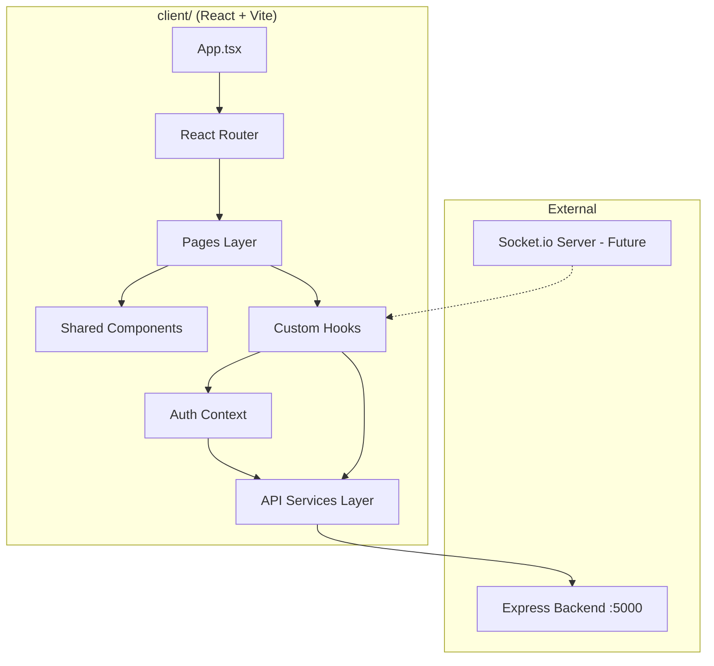

# Design Document: Frontend Architecture

## Overview

HostelCart AI is a collaborative group-ordering platform for hostel residents. The frontend provides a React-based single-page application that enables users to create and join purchase groups, manage shared carts, handle payment flows, and gives group leaders administrative controls over their groups.

The architecture prioritizes clear separation of concerns—isolating API communication, authentication state, UI components, and routing logic into distinct layers. This enables independent development of features, straightforward testing, and future extensibility (e.g., real-time updates via Socket.io).

The frontend communicates exclusively with the Express.js backend at `http://localhost:5000`, using JWT tokens for authenticated requests. The UI is styled with Tailwind CSS and uses React Router for client-side navigation with protected route guards.

## Architecture

