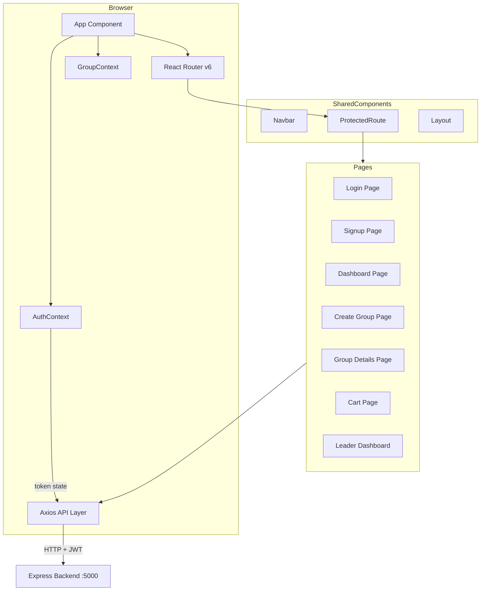
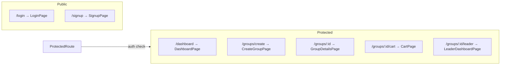
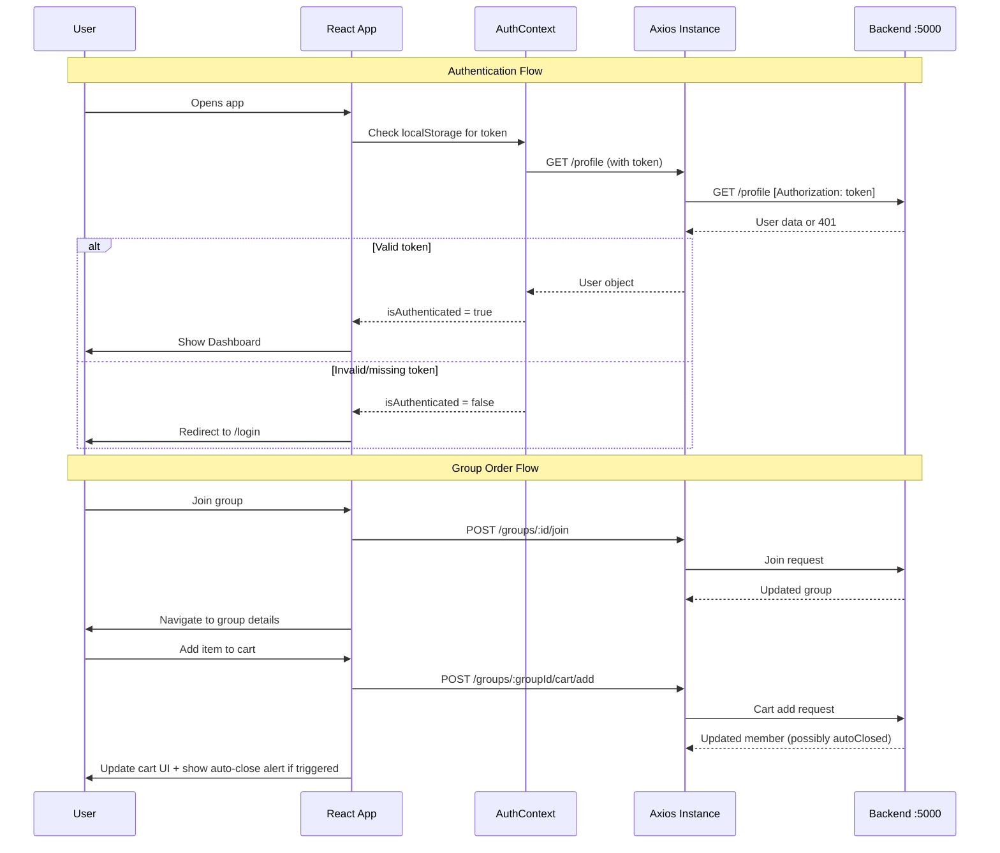
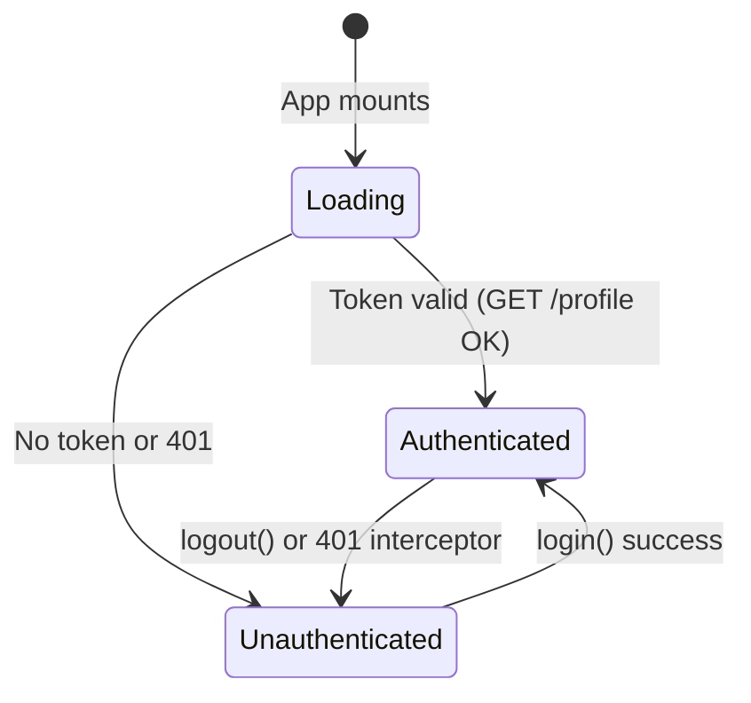

# Design Document: Frontend Foundation

## Overview

HostelCart is a collaborative group ordering platform for hostel residents. The frontend provides a React-based single-page application that allows users to create or join delivery groups, manage shared shopping carts, handle payments, and enables group leaders to manage order lifecycle. The architecture prioritizes simplicity using React Context for state management, Axios for API communication, and Tailwind CSS for responsive mobile-first styling.

The frontend communicates with an Express.js backend running on port 5000 that exposes REST endpoints for authentication, group management, cart CRUD, payment flows, and summary generation. JWT tokens are used for authentication with a raw token (no "Bearer" prefix) sent in the Authorization header.

## Architecture



## Folder Structure

```
src/
├── components/
│   ├── layout/
│   │   ├── Navbar.jsx
│   │   ├── Sidebar.jsx
│   │   ├── Footer.jsx
│   │   └── Layout.jsx
│   ├── shared/
│   │   ├── Button.jsx
│   │   ├── Card.jsx
│   │   ├── Input.jsx
│   │   ├── Modal.jsx
│   │   ├── Badge.jsx
│   │   ├── Spinner.jsx
│   │   ├── Alert.jsx
│   │   └── ProgressBar.jsx
│   └── features/
│       ├── cart/
│       │   ├── CartItem.jsx
│       │   ├── CartList.jsx
│       │   └── AddItemForm.jsx
│       ├── group/
│       │   ├── GroupCard.jsx
│       │   ├── MemberList.jsx
│       │   └── GroupProgress.jsx
│       └── leader/
│           ├── PaymentTable.jsx
│           ├── FeeEditor.jsx
│           └── ShoppingListView.jsx
├── pages/
│   ├── LoginPage.jsx
│   ├── SignupPage.jsx
│   ├── DashboardPage.jsx
│   ├── CreateGroupPage.jsx
│   ├── GroupDetailsPage.jsx
│   ├── CartPage.jsx
│   └── LeaderDashboardPage.jsx
├── services/
│   └── api.js
├── contexts/
│   ├── AuthContext.jsx
│   └── GroupContext.jsx
├── hooks/
│   ├── useAuth.js
│   ├── useGroup.js
│   └── useApi.js
├── utils/
│   ├── constants.js
│   ├── formatters.js
│   └── validators.js
├── App.jsx
└── main.jsx
```

## Route Structure



### Route Definitions

```typescript
// Route configuration
const routes = [
  // Public routes (no auth required)
  { path: "/login", element: LoginPage, public: true },
  { path: "/signup", element: SignupPage, public: true },

  // Protected routes (redirect to /login if no token)
  { path: "/dashboard", element: DashboardPage },
  { path: "/groups/create", element: CreateGroupPage },
  { path: "/groups/:id", element: GroupDetailsPage },
  { path: "/groups/:id/cart", element: CartPage },
  { path: "/groups/:id/leader", element: LeaderDashboardPage },

  // Redirect root to dashboard
  { path: "/", redirect: "/dashboard" },
]
```

## Components and Interfaces

### Component: ProtectedRoute

**Purpose**: Guards routes requiring authentication. Redirects unauthenticated users to login.

```typescript
interface ProtectedRouteProps {
  children: React.ReactNode
}

// Behavior:
// - Reads token from AuthContext
// - If token exists → render children
// - If no token → Navigate to /login with return URL in state
```

**Responsibilities**:
- Check authentication state from AuthContext
- Redirect unauthenticated users to /login
- Preserve intended destination for post-login redirect

### Component: Layout

**Purpose**: Wraps authenticated pages with Navbar and responsive container.

```typescript
interface LayoutProps {
  children: React.ReactNode
}

// Structure:
// <div className="min-h-screen bg-gray-50">
//   <Navbar />
//   <main className="container mx-auto px-4 py-6">
//     {children}
//   </main>
// </div>
```

**Responsibilities**:
- Render Navbar with user info and logout
- Provide consistent page container
- Handle responsive sidebar toggle on desktop

### Component: Navbar

**Purpose**: Top navigation bar with user info, navigation links, and mobile hamburger menu.

```typescript
interface NavbarProps {
  user: User | null
  onLogout: () => void
}
```

**Responsibilities**:
- Display app branding
- Show user name and hostel
- Navigation links (Dashboard, Create Group)
- Logout button
- Mobile hamburger menu toggle

### Component: GroupCard

**Purpose**: Displays group summary in dashboard list.

```typescript
interface GroupCardProps {
  group: Group
  currentUserEmail: string
  onJoin: (groupId: string) => void
}
```

**Responsibilities**:
- Show store name, hostel, status, member count
- Show progress toward delivery threshold
- Join button (disabled if already member or group closed)
- Navigate to group details on click

### Component: CartItem

**Purpose**: Displays a single cart item with edit/remove controls.

```typescript
interface CartItemProps {
  item: CartItemData
  isLocked: boolean
  onEdit: (itemId: string, updates: Partial<CartItemData>) => void
  onRemove: (itemId: string) => void
}
```

**Responsibilities**:
- Display product name, quantity, price, item total
- Edit button (opens inline edit or modal)
- Remove button with confirmation
- Disabled state when cart is locked (payment verified)

## Data Models

### User

```typescript
interface User {
  _id: string
  name: string
  email: string
  hostelName: string
  roomNumber?: string
}
```

### Group

```typescript
interface Group {
  _id: string
  storeName: string
  groupLeader: string        // email of leader
  hostelName: string
  closingTime: string        // ISO date string
  deliveryFee: number
  deliveryThreshold: number
  handlingFee: number
  platformFee: number
  closeMode: "TIME" | "TARGET"
  isClosed: boolean
  status: string
  members: Member[]
}
```

### Member

```typescript
interface Member {
  _id: string
  name: string
  email: string
  paid: boolean
  paymentVerified: boolean
  totalAmount: number
  cartItems: CartItemData[]
}
```

### CartItemData

```typescript
interface CartItemData {
  _id: string
  productName: string
  productLink?: string
  quantity: number
  price: number
  itemTotal: number
}
```

### AuthState

```typescript
interface AuthState {
  user: User | null
  token: string | null
  isAuthenticated: boolean
  isLoading: boolean
}
```

### GroupSummary

```typescript
interface GroupSummary {
  storeName: string
  closeMode: "TIME" | "TARGET"
  groupTotal: number
  deliveryThreshold: number
  remainingForFreeDelivery: number
  freeDeliveryAchieved: boolean
  isClosed: boolean
}
```

### FinalSummary

```typescript
interface FinalSummary {
  groupTotal: number
  freeDeliveryAchieved: boolean
  totalCharges: number
  sharePerPerson: number
  memberBreakdown: MemberBreakdown[]
}

interface MemberBreakdown {
  name: string
  email: string
  cartTotal: number
  chargeShare: number
  finalPayable: number
  paid: boolean
}
```

**Validation Rules**:
- `productName` must be non-empty string
- `quantity` must be positive integer
- `price` must be positive number
- `email` must be valid email format
- `password` must be at least 6 characters (signup)

## Main Algorithm/Workflow



## Key Functions with Formal Specifications

### Function: createAxiosInstance()

```typescript
function createAxiosInstance(): AxiosInstance
```

**Preconditions:**
- Base URL is defined (defaults to `http://localhost:5000`)

**Postconditions:**
- Returns configured Axios instance
- Request interceptor attaches token from localStorage to Authorization header
- Response interceptor catches 401 → clears token → redirects to /login
- All requests include Content-Type: application/json

### Function: login(email, password)

```typescript
function login(email: string, password: string): Promise<void>
```

**Preconditions:**
- `email` is non-empty valid email string
- `password` is non-empty string

**Postconditions:**
- On success: token stored in localStorage, user fetched from /profile, AuthContext updated
- On failure: error message returned, no state changes
- Token is the raw JWT string (no "Bearer" prefix)

### Function: logout()

```typescript
function logout(): void
```

**Preconditions:**
- None (safe to call in any state)

**Postconditions:**
- Token removed from localStorage
- AuthContext reset: user = null, token = null, isAuthenticated = false
- Router navigates to /login

### Function: restoreSession()

```typescript
function restoreSession(): Promise<void>
```

**Preconditions:**
- Called once on app mount (AuthContext initialization)

**Postconditions:**
- If token in localStorage: validates via GET /profile
  - Valid → sets user + isAuthenticated = true
  - Invalid (401) → clears token, isAuthenticated = false
- If no token: isAuthenticated = false immediately
- isLoading transitions from true → false in all cases

### Function: addCartItem(groupId, item)

```typescript
function addCartItem(
  groupId: string,
  item: { productName: string; productLink?: string; quantity: number; price: number }
): Promise<{ member: Member; autoClosed?: boolean }>
```

**Preconditions:**
- User is authenticated (token exists)
- User is a member of the group
- Group is not closed
- Cart is not locked (member's paymentVerified !== true)
- `item.productName` is non-empty
- `item.quantity` > 0
- `item.price` > 0

**Postconditions:**
- Item added to member's cart on backend
- Returns updated member object
- If `autoClosed: true` → group's isClosed is now true (TARGET mode threshold reached)
- UI should refresh group state on auto-close

## Algorithmic Pseudocode

### Authentication Initialization Algorithm

```pascal
ALGORITHM restoreSession
INPUT: none (reads from localStorage)
OUTPUT: AuthState update

BEGIN
  SET isLoading = true

  token ← localStorage.getItem("hostelcart_token")

  IF token IS NULL THEN
    SET isAuthenticated = false
    SET user = null
    SET isLoading = false
    RETURN
  END IF

  TRY
    user ← API.GET("/profile", headers: { Authorization: token })
    SET isAuthenticated = true
    SET user = user
    SET token = token
  CATCH error
    IF error.status = 401 THEN
      localStorage.removeItem("hostelcart_token")
      SET isAuthenticated = false
      SET user = null
      SET token = null
    END IF
  FINALLY
    SET isLoading = false
  END TRY
END
```

**Preconditions:**
- localStorage API is available
- API instance is configured with base URL

**Postconditions:**
- AuthState is fully resolved (loading complete)
- If token was invalid, it is cleaned from storage

### Axios Interceptor Algorithm

```pascal
ALGORITHM requestInterceptor
INPUT: config (Axios request config)
OUTPUT: modified config

BEGIN
  token ← localStorage.getItem("hostelcart_token")

  IF token IS NOT NULL THEN
    config.headers.Authorization ← token
  END IF

  RETURN config
END

ALGORITHM responseErrorInterceptor
INPUT: error (Axios error response)
OUTPUT: rejected promise

BEGIN
  IF error.response.status = 401 THEN
    localStorage.removeItem("hostelcart_token")
    window.location.href ← "/login"
  END IF

  RETURN Promise.reject(error)
END
```

**Preconditions:**
- Interceptors are registered on Axios instance creation

**Postconditions:**
- Every outbound request has token attached (if exists)
- Any 401 response triggers automatic logout + redirect

### Protected Route Guard Algorithm

```pascal
ALGORITHM ProtectedRoute
INPUT: children (React components), authState
OUTPUT: rendered children OR redirect

BEGIN
  IF authState.isLoading THEN
    RETURN <Spinner />
  END IF

  IF authState.isAuthenticated = false THEN
    RETURN <Navigate to="/login" state={ from: currentPath } />
  END IF

  RETURN children
END
```

**Preconditions:**
- AuthContext is available in component tree
- React Router's Navigate component is available

**Postconditions:**
- Unauthenticated users never see protected content
- Loading state shows spinner (prevents flash of login page)
- Return URL preserved for post-login redirect

### Cart Lock Detection Algorithm

```pascal
ALGORITHM isCartLocked
INPUT: group (Group), userEmail (string)
OUTPUT: boolean

BEGIN
  member ← group.members.find(m => m.email = userEmail)

  IF member IS NULL THEN
    RETURN true  // Not a member, lock by default
  END IF

  IF member.paymentVerified = true THEN
    RETURN true  // Payment verified, cart locked
  END IF

  IF group.isClosed THEN
    RETURN true  // Group closed, no modifications
  END IF

  RETURN false
END
```

**Preconditions:**
- Group object is loaded with members array
- User email is available from AuthContext

**Postconditions:**
- Returns true if user should NOT be able to modify cart
- UI uses this to disable add/edit/remove buttons

## Example Usage

```typescript
// Example 1: API service setup
import axios from "axios"

const api = axios.create({
  baseURL: "http://localhost:5000",
  headers: { "Content-Type": "application/json" }
})

api.interceptors.request.use((config) => {
  const token = localStorage.getItem("hostelcart_token")
  if (token) {
    config.headers.Authorization = token
  }
  return config
})

api.interceptors.response.use(
  (response) => response,
  (error) => {
    if (error.response?.status === 401) {
      localStorage.removeItem("hostelcart_token")
      window.location.href = "/login"
    }
    return Promise.reject(error)
  }
)

// Example 2: AuthContext usage
function AuthProvider({ children }) {
  const [state, setState] = useState({
    user: null, token: null, isAuthenticated: false, isLoading: true
  })

  useEffect(() => { restoreSession() }, [])

  const login = async (email, password) => {
    const { data } = await api.post("/login", { email, password })
    localStorage.setItem("hostelcart_token", data.token)
    const { data: user } = await api.get("/profile")
    setState({ user, token: data.token, isAuthenticated: true, isLoading: false })
  }

  const logout = () => {
    localStorage.removeItem("hostelcart_token")
    setState({ user: null, token: null, isAuthenticated: false, isLoading: false })
  }

  return <AuthContext.Provider value={{ ...state, login, logout }}>{children}</AuthContext.Provider>
}

// Example 3: Protected route pattern
function App() {
  return (
    <AuthProvider>
      <BrowserRouter>
        <Routes>
          <Route path="/login" element={<LoginPage />} />
          <Route path="/signup" element={<SignupPage />} />
          <Route path="/dashboard" element={
            <ProtectedRoute><Layout><DashboardPage /></Layout></ProtectedRoute>
          } />
          <Route path="/groups/:id" element={
            <ProtectedRoute><Layout><GroupDetailsPage /></Layout></ProtectedRoute>
          } />
        </Routes>
      </BrowserRouter>
    </AuthProvider>
  )
}

// Example 4: Cart operations in CartPage
function CartPage() {
  const { groupId } = useParams()
  const { user } = useAuth()
  const [group, setGroup] = useState(null)

  const isLocked = isCartLocked(group, user.email)

  const handleAddItem = async (item) => {
    const { data } = await api.post(`/groups/${groupId}/cart/add`, item)
    if (data.autoClosed) {
      alert("Target reached! Group closed automatically.")
    }
    refreshGroup()
  }
}
```

## State Management Design

### AuthContext



**State Shape:**
```typescript
interface AuthContextValue {
  user: User | null
  token: string | null
  isAuthenticated: boolean
  isLoading: boolean
  login: (email: string, password: string) => Promise<void>
  logout: () => void
}
```

**Storage Strategy**: localStorage
- Token persists across browser sessions (7-day expiry set by backend)
- Key: `hostelcart_token`
- Cleared on logout or 401 response

### GroupContext

```typescript
interface GroupContextValue {
  activeGroup: Group | null
  summary: GroupSummary | null
  isLeader: boolean
  isLoading: boolean
  fetchGroup: (groupId: string) => Promise<void>
  refreshGroup: () => Promise<void>
  clearGroup: () => void
}
```

**Scope**: Active when user is viewing a specific group (`/groups/:id/*` routes).

**Leader Detection**: `group.groupLeader.toLowerCase() === user.email.toLowerCase()`

## API Layer Design

### Service Methods

```typescript
// Auth endpoints
api.post("/signup", { name, email, password, hostelName, roomNumber })
api.post("/login", { email, password }) // → { token }
api.get("/profile")                     // → User

// Group endpoints
api.get("/groups")                      // → Group[]
api.post("/groups", groupData)          // → { group }
api.post("/groups/:id/join", { name, email }) // → { group }

// Cart endpoints (require auth)
api.post("/groups/:groupId/cart/add", { productName, productLink, quantity, price })
api.put("/groups/:groupId/cart/edit", { itemId, productName, productLink, quantity, price })
api.delete("/groups/:groupId/cart/remove", { itemId })

// Payment endpoints
api.post("/groups/:groupId/pay", { email })
api.post("/groups/:groupId/verify-payment", { email })  // leader only

// Leader endpoints
api.put("/groups/:groupId/fees", { deliveryFee, handlingFee, platformFee })
api.post("/groups/:groupId/close")

// Summary endpoints
api.get("/groups/:groupId/summary")
api.get("/groups/:groupId/final-summary")
api.get("/groups/:groupId/shopping-list")
api.get("/groups/:groupId/final-shopping-list")
```

### Error Handling Pattern

```typescript
interface ApiError {
  message: string
  status: number
}

// Standard error extraction from Axios errors
function extractError(error: AxiosError): ApiError {
  return {
    message: error.response?.data?.message || "Something went wrong",
    status: error.response?.status || 500
  }
}
```

**Error handling by status code:**
- `400` → Show validation message to user (inline form error)
- `401` → Interceptor handles (auto-logout + redirect)
- `403` → Show "Access denied" (not leader)
- `404` → Show "Not found" message or redirect
- `500` → Show generic error alert

## Responsive Design Strategy

### Breakpoint Usage

| Breakpoint | Width | Layout |
|-----------|-------|--------|
| Default (mobile) | < 640px | Single column, hamburger nav, stacked cards |
| `sm` | ≥ 640px | Two-column where appropriate |
| `md` | ≥ 768px | Sidebar appears, wider cards |
| `lg` | ≥ 1024px | Full desktop layout |

### Navigation Pattern

- **Mobile (< md)**: Top navbar with hamburger → slide-out drawer
- **Desktop (≥ md)**: Top navbar with inline links, optional sidebar for group navigation

### Component Responsive Patterns

```typescript
// Card grid: 1 col mobile → 2 col tablet → 3 col desktop
// className="grid grid-cols-1 sm:grid-cols-2 lg:grid-cols-3 gap-4"

// Navbar: hamburger on mobile, links on desktop
// className="hidden md:flex" (desktop links)
// className="md:hidden" (hamburger button)

// Form layouts: full width mobile → constrained on desktop
// className="w-full max-w-md mx-auto"
```

## Error Handling

### Scenario: Token Expiry During Session

**Condition**: User's 7-day token expires while app is open
**Response**: Next API call returns 401 → response interceptor fires
**Recovery**: Clear token from localStorage, redirect to /login, show "Session expired" toast

### Scenario: Network Failure

**Condition**: API call fails with no response (network error)
**Response**: Show "Connection error" alert with retry option
**Recovery**: User clicks retry or refreshes page

### Scenario: Cart Lock Violation

**Condition**: User attempts cart modification after payment verification
**Response**: Backend returns 403 via cartLock middleware
**Recovery**: UI should proactively disable controls via `isCartLocked()` check, but if race condition occurs, show "Cart is locked" message and refresh group state

### Scenario: Group Auto-Close During Cart Add

**Condition**: Adding an item triggers TARGET threshold → backend auto-closes group
**Response**: API returns `{ autoClosed: true }` flag
**Recovery**: Show alert "Target reached! Group closed automatically.", refresh group state, disable further cart modifications

## Testing Strategy

### Unit Testing Approach

- Test utility functions (formatters, validators, isCartLocked)
- Test context providers in isolation (mock API responses)
- Test ProtectedRoute redirect logic
- Framework: Vitest + React Testing Library

### Property-Based Testing Approach

**Property Test Library**: fast-check

- Cart total always equals sum of itemTotal values
- isCartLocked returns true for all closed groups
- Route guard never renders children when unauthenticated
- API error extraction always returns valid ApiError shape

### Integration Testing Approach

- Test full login → dashboard → group → cart flow
- Test leader-specific routes block non-leaders
- Mock API layer with MSW (Mock Service Worker)

## Future Socket.io Integration Points

### Connection Lifecycle

```typescript
// Socket connects after authentication
// Joins room for active group: socket.emit("join-group", groupId)
// Disconnects on logout or group exit
```

### Real-Time Update Recipients

| Event | Component | Action |
|-------|-----------|--------|
| `member-joined` | GroupDetailsPage, MemberList | Add member to list |
| `cart-updated` | CartPage, GroupProgress | Refresh cart/totals |
| `payment-marked` | LeaderDashboardPage, PaymentTable | Update payment status |
| `payment-verified` | CartPage | Lock cart controls |
| `group-closed` | All group pages | Show closed state, disable actions |
| `fees-updated` | GroupDetailsPage | Update fee display |

### Components Needing Live Data

- **GroupProgress**: Live group total and threshold progress
- **MemberList**: Live member join/leave
- **PaymentTable** (Leader): Live payment status updates
- **CartPage**: Cart lock state when payment gets verified

## Performance Considerations

- Lazy load page components with `React.lazy()` + `Suspense`
- Memoize expensive list renders with `React.memo` (GroupCard list, CartItem list)
- Debounce cart edit operations (300ms) to avoid rapid API calls
- Cache group list on dashboard (stale-while-revalidate pattern with manual refresh)

## Security Considerations

- JWT stored in localStorage (acceptable for this use case; HttpOnly cookies not possible with current backend)
- Token sent as raw string in Authorization header (matching backend auth.js expectation)
- No sensitive data stored client-side beyond token
- Input sanitization: trim whitespace, validate before submission
- XSS prevention: React's default escaping + avoid `dangerouslySetInnerHTML`

## Dependencies

| Package | Purpose |
|---------|---------|
| react | UI framework |
| react-dom | DOM rendering |
| react-router-dom | Client-side routing |
| axios | HTTP client |
| tailwindcss | Utility-first CSS |
| @tailwindcss/forms | Form element styling |
| vite | Build tool and dev server |
| vitest | Unit testing |
| @testing-library/react | Component testing |
| fast-check | Property-based testing |
| msw | API mocking for tests |
