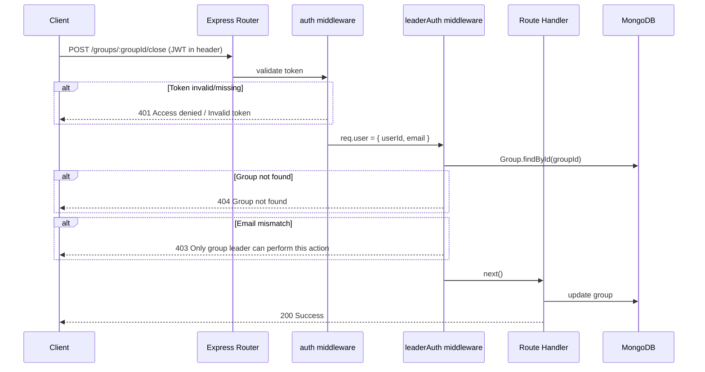
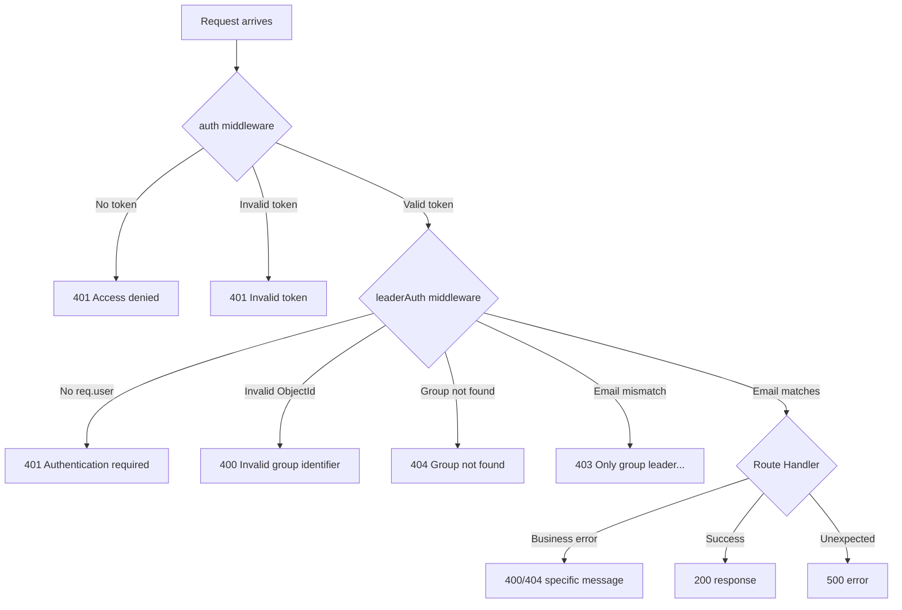

# Design Document: Leader-Only Authorization

## Overview

This design introduces a reusable `leaderAuth` middleware that gates privileged group operations (close, verify-payment, update-fees) behind a leader identity check. The middleware chains after the existing `auth` middleware, reads the group identifier from route parameters, fetches the group document, and performs a case-insensitive email comparison between `req.user.email` (set by `auth`) and `group.groupLeader`. Non-leaders receive a 403 response; missing groups yield 404; invalid ObjectIds yield 400.

The approach is purely additive: no schema changes, no modifications to the existing `auth.js`, and no impact on public endpoints. Three existing endpoints gain authorization, and one new endpoint (fee updates) is introduced — all protected by the `[auth, leaderAuth]` middleware chain.

## Architecture

### High-Level Request Flow



### Middleware Chain Pattern

```
[auth, leaderAuth, routeHandler]
 │         │            │
 │         │            └── Business logic (close, verify, update fees)
 │         └── Leader verification (group lookup + email compare)
 └── JWT validation (token → req.user)
```

### Affected Endpoints

| Endpoint | Method | Current Middleware | New Middleware | Route Param |
|----------|--------|--------------------|----------------|-------------|
| `/groups/:groupId/close` | POST | None | `[auth, leaderAuth]` | `groupId` |
| `/groups/:groupId/verify-payment` | POST | None | `[auth, leaderAuth]` | `groupId` |
| `/groups/:groupId/fees` | PUT | None (new) | `[auth, leaderAuth]` | `groupId` |

### Unchanged Endpoints (No Auth Required)

| Endpoint | Method | Reason |
|----------|--------|--------|
| `GET /groups` | GET | Public listing |
| `POST /groups/:id/join` | POST | Open membership |
| `POST /groups/:groupId/cart` | POST | Member self-service |
| `POST /groups/:groupId/pay` | POST | Member self-service |
| `GET /groups/:groupId/summary` | GET | Public summary |

## Components and Interfaces

### New File: `server/middleware/leaderAuth.js`

```javascript
const mongoose = require("mongoose");
const Group = require("../models/group");

/**
 * Leader Authorization Middleware
 * Must be used after auth middleware in route chain.
 * Reads group ID from req.params.groupId or req.params.id.
 * Compares req.user.email against group.groupLeader (case-insensitive).
 */
const leaderAuth = async (req, res, next) => {
    try {
        // 1. Ensure auth middleware ran
        if (!req.user) {
            return res.status(401).json({
                message: "Authentication required"
            });
        }

        // 2. Resolve group ID from route params
        const groupId = req.params.groupId || req.params.id;

        // 3. Validate ObjectId format
        if (!mongoose.Types.ObjectId.isValid(groupId)) {
            return res.status(400).json({
                message: "Invalid group identifier"
            });
        }

        // 4. Fetch group
        const group = await Group.findById(groupId);
        if (!group) {
            return res.status(404).json({
                message: "Group not found"
            });
        }

        // 5. Case-insensitive email comparison
        if (req.user.email.toLowerCase() !== group.groupLeader.toLowerCase()) {
            return res.status(403).json({
                message: "Only group leader can perform this action"
            });
        }

        // 6. Attach group to request for reuse in handler
        req.group = group;
        next();
    } catch (error) {
        res.status(500).json({
            message: "Authorization check failed"
        });
    }
};

module.exports = leaderAuth;
```

### Interface Contract

| Input | Source | Description |
|-------|--------|-------------|
| `req.user.email` | Set by `auth` middleware | Authenticated user's email |
| `req.params.groupId` or `req.params.id` | Express route | Target group identifier |

| Output | Condition | HTTP Status | Body |
|--------|-----------|-------------|------|
| `next()` | Email matches groupLeader | — | — |
| Error response | No `req.user` | 401 | `{ message: "Authentication required" }` |
| Error response | Invalid ObjectId | 400 | `{ message: "Invalid group identifier" }` |
| Error response | Group not found | 404 | `{ message: "Group not found" }` |
| Error response | Email mismatch | 403 | `{ message: "Only group leader can perform this action" }` |
| Error response | Internal error | 500 | `{ message: "Authorization check failed" }` |

### Side Effect: `req.group`

The middleware attaches the fetched group document to `req.group`. Route handlers can use this directly, avoiding a redundant database query.

### Route Handler Changes

#### `POST /groups/:groupId/close` (modified)

```javascript
app.post("/groups/:groupId/close", [auth, leaderAuth], async (req, res) => {
    try {
        const group = req.group; // already fetched by leaderAuth

        if (group.isClosed) {
            return res.status(400).json({
                message: "Group is already closed"
            });
        }

        group.isClosed = true;
        await group.save();

        res.json({ message: "Group closed successfully" });
    } catch (error) {
        res.status(500).json({ message: error.message });
    }
});
```

#### `POST /groups/:groupId/verify-payment` (modified)

```javascript
app.post("/groups/:groupId/verify-payment", [auth, leaderAuth], async (req, res) => {
    try {
        const group = req.group;

        const member = group.members.find(
            m => m.email === req.body.email
        );

        if (!member) {
            return res.status(404).json({
                message: "Member not found"
            });
        }

        member.paymentVerified = true;
        member.paid = true;
        await group.save();

        res.json({ message: "Payment verified" });
    } catch (error) {
        res.status(500).json({ message: error.message });
    }
});
```

#### `PUT /groups/:groupId/fees` (new endpoint)

```javascript
app.put("/groups/:groupId/fees", [auth, leaderAuth], async (req, res) => {
    try {
        const group = req.group;
        const { deliveryFee, handlingFee, platformFee } = req.body;

        // Validate at least one fee field present
        if (deliveryFee === undefined && handlingFee === undefined && platformFee === undefined) {
            return res.status(400).json({
                message: "At least one fee field is required (deliveryFee, handlingFee, platformFee)"
            });
        }

        // Validate each provided fee
        const fields = { deliveryFee, handlingFee, platformFee };
        for (const [field, value] of Object.entries(fields)) {
            if (value !== undefined) {
                if (typeof value !== "number" || value < 0 || value > 99999) {
                    return res.status(400).json({
                        message: `Invalid value for ${field}: must be a number between 0 and 99999`
                    });
                }
            }
        }

        // Apply updates
        if (deliveryFee !== undefined) group.deliveryFee = deliveryFee;
        if (handlingFee !== undefined) group.handlingFee = handlingFee;
        if (platformFee !== undefined) group.platformFee = platformFee;

        await group.save();

        res.json(group);
    } catch (error) {
        res.status(500).json({ message: error.message });
    }
});
```

## Data Models

### No Schema Changes Required

The existing Group schema already contains all fields needed:
- `groupLeader` (String) — stores the leader's email, used for comparison
- `isClosed` (Boolean) — used by close endpoint
- `paymentVerified` (Boolean, per member) — used by verify-payment endpoint
- `deliveryFee`, `handlingFee`, `platformFee` (Number) — used by fee update endpoint

### JWT Payload Structure (existing, unchanged)

```javascript
{
    userId: ObjectId,  // MongoDB user ID
    email: String      // User email (used for leader comparison)
}
```

### Database Considerations

- **No migration needed**: All existing documents remain valid.
- **Index recommendation**: Consider adding an index on `groupLeader` if leader lookups become a hot path, though the current lookup is by `_id` so this is not critical.
- **Query pattern**: `leaderAuth` uses `Group.findById(groupId)` — this is already indexed by `_id`.

## Backward Compatibility

| Concern | Mitigation |
|---------|-----------|
| Existing `/close` callers without token | They will now get 401. This is intentional — the endpoint was insecure before. Frontend must send JWT. |
| Existing `/verify-payment` callers | Same as above — must include JWT. |
| Schema stability | Zero schema changes. All existing documents valid. |
| Public endpoints | `GET /groups`, `POST /:id/join`, `POST /:groupId/cart`, `POST /:groupId/pay`, `GET /:groupId/summary` remain unchanged. |
| `auth.js` | Not modified. Same interface, same behavior. |
| Route param flexibility | `leaderAuth` checks both `req.params.groupId` and `req.params.id`, covering both naming conventions in use. |

## Security Considerations

1. **Identity source**: Leader identity is derived exclusively from JWT (server-side verification), never from request body or query params — prevents spoofing.
2. **Case-insensitive comparison**: Prevents bypass through email casing tricks (e.g., `Leader@email.com` vs `leader@email.com`).
3. **Defense in depth**: `leaderAuth` checks for `req.user` existence even though it should always follow `auth` — guards against misconfiguration.
4. **ObjectId validation**: Prevents Mongoose CastError and potential injection by validating format before query.
5. **Group pre-fetch**: The middleware fetches the group once and passes it via `req.group`, preventing TOCTOU (time-of-check-time-of-use) issues where the group could change between middleware and handler.
6. **No token modification**: The existing auth middleware and JWT structure remain unchanged — no new attack surface.


## Correctness Properties

*A property is a characteristic or behavior that should hold true across all valid executions of a system — essentially, a formal statement about what the system should do. Properties serve as the bridge between human-readable specifications and machine-verifiable correctness guarantees.*

### Property 1: Authorization uses server-side identity exclusively

*For any* request where `req.user.email` differs from `req.body.email`, the leaderAuth middleware SHALL base its authorization decision solely on `req.user.email`, ignoring any email value present in the request body or query parameters.

**Validates: Requirements 1.1**

### Property 2: Case-insensitive leader authorization decision

*For any* authenticated user email and group leader email, the leaderAuth middleware SHALL grant access if and only if the two emails are equal when compared case-insensitively. Specifically: `email_a.toLowerCase() === email_b.toLowerCase()` implies access granted, and any case variation of the same base email SHALL produce the same authorization outcome.

**Validates: Requirements 1.2, 1.3, 1.4**

### Property 3: Route parameter flexibility

*For any* valid group ObjectId, the leaderAuth middleware SHALL resolve the group identifier correctly regardless of whether it is provided as `req.params.groupId` or `req.params.id`, preferring `groupId` when both are present.

**Validates: Requirements 5.2**

### Property 4: Invalid ObjectId rejection

*For any* string that does not conform to the MongoDB ObjectId format (24-character hex string), the leaderAuth middleware SHALL reject the request with HTTP 400 without attempting a database query.

**Validates: Requirements 5.6**

### Property 5: Close operation idempotency guard

*For any* group where `isClosed` is `false`, the close handler SHALL set `isClosed` to `true` and return 200. For any group where `isClosed` is already `true`, the close handler SHALL return 400 without modifying the document.

**Validates: Requirements 2.4, 2.6**

### Property 6: Payment verification targets correct member

*For any* group with N members, calling verify-payment with a member email that exists in the members array SHALL set `paymentVerified = true` only for that specific member and leave all other members' `paymentVerified` field unchanged.

**Validates: Requirements 3.4**

### Property 7: Fee update applies only specified fields

*For any* valid fee update request containing a subset S of {deliveryFee, handlingFee, platformFee}, only the fields in S SHALL be modified on the group document. All fee fields NOT in S SHALL retain their previous values.

**Validates: Requirements 4.4**

### Property 8: Invalid fee values are rejected

*For any* fee value that is not a number, or is a number less than 0 or greater than 99999, the fee update handler SHALL reject the entire request with HTTP 400 without modifying any field on the group document.

**Validates: Requirements 4.5**

## Error Handling

### Error Response Strategy

All errors use a consistent JSON structure: `{ "message": "<descriptive text>" }`

| Layer | Error Condition | HTTP Status | Message |
|-------|-----------------|-------------|---------|
| `auth` middleware | Missing token | 401 | "Access denied" |
| `auth` middleware | Invalid/expired token | 401 | "Invalid token" |
| `leaderAuth` middleware | `req.user` not set | 401 | "Authentication required" |
| `leaderAuth` middleware | Invalid ObjectId format | 400 | "Invalid group identifier" |
| `leaderAuth` middleware | Group not found | 404 | "Group not found" |
| `leaderAuth` middleware | Email mismatch | 403 | "Only group leader can perform this action" |
| Close handler | Group already closed | 400 | "Group is already closed" |
| Verify-payment handler | Member not found | 404 | "Member not found" |
| Fee update handler | No fee fields provided | 400 | "At least one fee field is required..." |
| Fee update handler | Invalid fee value | 400 | "Invalid value for {field}: must be a number between 0 and 99999" |
| Any handler | Unexpected error | 500 | Error message or generic failure |

### Error Propagation Flow



### Design Decisions

1. **Early termination**: Each middleware layer terminates the request on failure, preventing downstream handlers from executing with invalid state.
2. **No error leaking**: Internal errors (e.g., database connection issues) return generic 500 messages without exposing stack traces or implementation details.
3. **Consistent format**: Every error response uses `{ "message": "..." }` so the frontend can reliably parse error information.

## Testing Strategy

### Testing Approach

This feature is well-suited for a dual testing approach:

- **Property-based tests**: The middleware authorization logic involves pure decision-making (email comparison, ObjectId validation, route param resolution) that varies meaningfully with input. These are ideal for PBT.
- **Unit tests (example-based)**: Specific edge cases, error conditions, and integration points.
- **Integration tests**: End-to-end route testing with real middleware chains.

### Property-Based Testing

**Library**: [fast-check](https://github.com/dubzzz/fast-check) (JavaScript PBT library for Node.js)

**Configuration**: Minimum 100 iterations per property test.

**Tag format**: `Feature: leader-only-authorization, Property {number}: {property_text}`

Each correctness property above maps to a property-based test:

| Property | Generator Strategy |
|----------|-------------------|
| P1: Identity source | Generate `{req.user.email, req.body.email, groupLeader}` triples where body.email ≠ user.email |
| P2: Case-insensitive decision | Generate random email strings with random case transformations |
| P3: Route param flexibility | Generate valid ObjectIds, assign to either `groupId` or `id` param randomly |
| P4: Invalid ObjectId | Generate random strings of varying lengths and character sets |
| P5: Close idempotency | Generate random `isClosed` boolean states |
| P6: Payment verification target | Generate groups with N random members, pick one to verify |
| P7: Fee update subset | Generate random subsets of fee fields with valid values |
| P8: Invalid fee rejection | Generate fee values outside [0, 99999] or non-number types |

### Unit Tests (Example-Based)

| Test Case | Type |
|-----------|------|
| Missing `req.user` → 401 | Edge case |
| Group not found → 404 | Edge case |
| Member not found in verify-payment → 404 | Edge case |
| No fee fields in body → 400 | Edge case |
| Group already closed → 400 | Edge case |
| Valid leader request succeeds → 200 | Happy path |

### Integration Tests

| Test Case | Validates |
|-----------|-----------|
| Full request chain: no token → 401 | Req 2.1, 3.1, 4.1 |
| Full request chain: valid token, non-leader → 403 | Req 2.3, 3.3, 4.3 |
| Full request chain: valid token, leader → 200 | Req 2.4, 3.4, 4.4 |
| Public endpoints still work without auth | Req 6.4 |
| Response shape matches pre-change contract | Req 6.3 |

### File Structure for Tests

```
server/
├── middleware/
│   ├── auth.js                    (existing, unchanged)
│   ├── leaderAuth.js              (new)
│   └── __tests__/
│       ├── leaderAuth.test.js     (unit + property tests)
│       └── leaderAuth.property.js (property-based tests)
├── routes/
│   └── __tests__/
│       └── groups.integration.js  (integration tests)
└── package.json                   (add jest + fast-check dev deps)
```

### Implementation Plan

#### Phase 1: Middleware Creation
1. Create `server/middleware/leaderAuth.js` with the implementation shown above
2. Export the middleware function

#### Phase 2: Route Protection
1. Add `[auth, leaderAuth]` to `POST /groups/:groupId/close`
2. Add `[auth, leaderAuth]` to `POST /groups/:groupId/verify-payment`
3. Add new `PUT /groups/:groupId/fees` with `[auth, leaderAuth]`
4. Update close handler to use `req.group` and add "already closed" check
5. Update verify-payment handler to use `req.group`

#### Phase 3: Testing Setup
1. Add `jest` and `fast-check` as dev dependencies
2. Write property-based tests for middleware logic
3. Write unit tests for edge cases
4. Write integration tests for full request flow

#### Files Changed

| File | Action | Description |
|------|--------|-------------|
| `server/middleware/leaderAuth.js` | Create | New leader authorization middleware |
| `server/server.js` | Modify | Add middleware to routes, add fee update endpoint, use req.group |
| `server/package.json` | Modify | Add jest, fast-check, supertest dev dependencies |
| `server/middleware/__tests__/leaderAuth.test.js` | Create | Unit tests |
| `server/middleware/__tests__/leaderAuth.property.js` | Create | Property-based tests |
